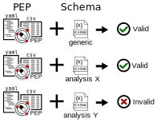

# How to write my own PEP schema

<figure>

<figcaption>You can validate any PEP against any Schema</figcaption>
</figure>

PEP is very flexible and can be used to annotate metadata for many different types of analysis. The basic PEP specification is described using a [generic schema](https://schema.databio.org/pep/2.0.0.yaml) that specifies the required and optional fields that must be specified in the PEP. This generic schema is very basic and flexible. This flexibility is nice, but also means two PEPs can represent very different data types, and therefore means they will work correctly with a particular tool, even if it is PEP-compatible. To allow PEP to be extended to specific use cases and establish these more detailed compatibilities, PEP provides a powerful validation framework. This allows tool authors to define a *schema* that describes specifically which attributes the sample and project must have, which are optional, what their types are, which attributes point to input files, and so on.

## Validating a generic PEP

You can validate a PEP against a PEP schema using the [eido Python package](http://eido.databio.org) like this:

```
eido validate path/to/your/PEP_config.yaml -s https://schema.databio.org/pep/2.0.0.yaml
```

## Validating a PEP for a specific tool

Most tools will require more attributes than a base PEP provides. For example, a tool may require a `genome` attribute for each sample and we need to validate a PEP against a stricter schema. You would do this in the same way, just using the more specialized schema:

```console
eido validate path/to/project_config.yaml -s SCHEMA
```

Where SCHEMA is a URL or local file. The author of the tool you are using should provide this schema so that you can make sure you are providing the correct metadata for the tool.


## Writing a PEP schema

If you are a tool developer, we recommend you write a PEP schema that describes what sample and project attributes are required for your tool to work. PEP schemas use the [JSON-schema](https://json-schema.org/) vocabulary. Like the PEP itself, the schema is divided into two sections, one for the project config, and one for the samples. So, the base PEP schema defines an object with two components: a `config` object, and a `samples` array:

```yaml
description: A example schema for a pipeline.
imports: http://schema.databio.org/pep/2.0.0.yaml
properties:
  config
    type: object
  samples:
    type: array
required:
  - samples
  - config
```

Let's say you're writing a PEP-compatible tool that requires 3 arguments: `read1`, `read2`, and `genome`, and also offers optional argument, `read_length`.  Validating the generic PEP specification will not confirm all required attributes, so you want to write an extended schema. Starting from the base above, we're not changing the `config` section so we can drop that, and we add new parameters for the required sample attributes like this:

```yaml
description: A example schema for a pipeline.
imports: http://schema.databio.org/pep/2.0.0.yaml
properties:
  samples:
    type: array
    items:
      type: object
      properties:
        read1:
          type: string
          description: "Fastq file for read 1"
        read2:
          type: string
          description: "Fastq file for read 2"
        genome:
          type: string
          description: "Refgenie genome registry identifier"          
        read_length:
          type: integer
          description: "Length of the Unique Molecular Identifier, if any"
      required:
        - read1
        - read2
        - genome
required:
  - samples
```

This document defines the required an optional sample attributes for this pipeline. That's all you need to do, and your users can validate an existing PEP to see if it meets the requirements of your tool.
