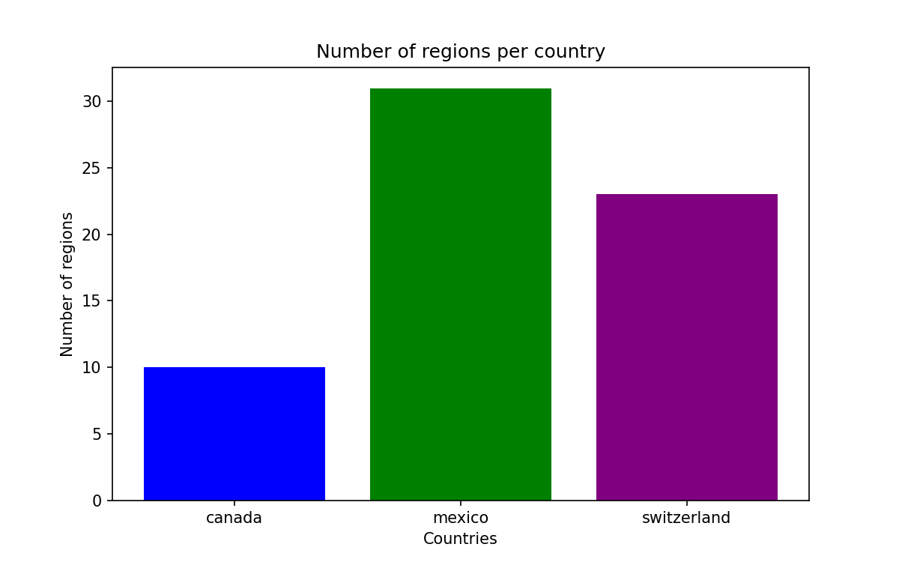

## Reporting objects using pipestat

This how-to guide assumes you have already completed the [pipestat tutorial](../tutorial/pipestat.md) as well as the how-to guide for [running project-level pipelines](project-level-pipelines.md).

So far, our examples have been reporting primitives such as integers. But what if our pipeline generates an image, and we wish to report this more complex object? We can leverage looper's integration with pipestat to accomplish this.

As an example, we will take the previous pipestat tutorial and modify it to run a project-level pipeline that will create and then report an image result. You can always download the completed tutorial files from the [hello looper repository](https://github.com/pepkit/hello_looper).


Ensure you are in the `pipestat_example` folder from the previous tutorial or after downloading the folder from the hello looper repository.

```shell
cd pipestat_example
```

Next run the sample level pipeline so that the sample-level results are reported to the pipestat backend, `results.yaml`:

```shell
looper run
```

We would like to take the number of regions from each sample (file) and collect them into a single plot. This plot will be stored as an image locally, and the path of this image will be reported to the pipestat backend.


We will need to add a `project_interface` to the `pipeline_interface`:

```yaml title="pipeline_interface.yaml" hl_lines="6-9"
pipeline_name: count_lines
output_schema: pipestat_output_schema.yaml
sample_interface:
  command_template: >
    python3 {looper.piface_dir}/count_lines.py {sample.file_path} {sample.sample_name} {pipestat.results_file} {pipestat.output_schema}
project_interface:
  command_template: >
    python3 {looper.piface_dir}/count_lines_plot.py {pipestat.results_file} {pipestat.output_schema}
```

We only need to pass the `pipestat.results_file` and the `pipestat.output_schema` to pipestat in this project-level example.

Next, we will modify the `.looper.yaml` config file to add a project name to the pipestat section. When running project-level pipelines with pipestat, we must supply a project name.

```yaml title=".looper.yaml" hl_lines="6"
pep_config: ./metadata/pep_config.yaml # pephub registry path or local path
output_dir: ./results
pipeline_interfaces:
  - pipeline/pipeline_interface.yaml
pipestat:
  project_name: count_lines
  results_file_path: results.yaml
  flag_file_dir: results/flags
```

We will also need to modify the pipestat output schema to report an image result. This is a more complex object than our previous integer results. For example, it has required fields. Let's modify our output schema now:

```yaml title="pipestat_output_schema.yaml" hl_lines="14-33"
title: Pipestat output schema for counting lines
description: A pipeline that uses pipestat to report sample level results.
type: object
properties:
  pipeline_name: count_lines
  samples:
    type: array
    items:
      type: object
      properties:
        number_of_lines:
          type: integer
          description: "Number of lines in the input file."
  project:
    type: object
    properties:
      regions_plot:
        description: "This a path to the output image"
        image:
          type: object
          object_type: image
          properties:
            path:
              type: string
            thumbnail_path:
              type: string
            title:
              type: string
          required:
            - path
            - thumbnail_path
            - title
```
We have three required fields in this schema, `path`, `thumbnail_path`, and `title`.

Finally, we must create our pipeline. Create a python file in the pipeline folder named `count_lines_plot.py`:

```py title="count_lines_plot.py"
import matplotlib.pyplot as plt  # be sure to `pip install matplotlib`
import os
import pipestat
import sys

# A pipeline that retrieves previously reported pipestat results
# and plots them in a bar chart
results_file = sys.argv[1]
schema_path = sys.argv[2]

# Create pipestat manager
psm = pipestat.PipestatManager(
    schema_path=schema_path,
    results_file_path=results_file,
    pipeline_type="project"
)

# Extract the previously reported data
results = psm.select_records() # pipestat object holds the data after reading the results file
countries = [record['record_identifier'] for record in results['records']]
number_of_regions = [record['number_of_lines'] for record in results['records']]

# Create a bar chart of regions per country
plt.figure(figsize=(8, 5))
plt.bar(countries, number_of_regions, color=['blue', 'green', 'purple'])
plt.xlabel('Countries')
plt.ylabel('Number of regions')
plt.title('Number of regions per country')

# Save the image locally AND report that location via pipestat
# we can place it next to the results file for now
save_location =  os.path.join(os.path.dirname(results_file), "regions_per_country.png")

plt.savefig(save_location, dpi=150)

result_to_report = {"regions_plot":
                        {"path": save_location,
                         "thumbnail_path": save_location,
                         "title": "Regions Plot"}}

psm.report(record_identifier="count_lines", values=result_to_report)
```


Looper passes the schema and results file to the pipeline. Pipestat then uses these items to create a PipestatManager object (`psm`) which can access the previously reported results.
  
Once we've plotted the results in a bar chart, we can report the location of the saved plot using pipestat. The structure of the reported image, `regions_plot`, is a nested dictionary and contains all the required fields from our modified pipestat output schema.


Make sure `count_lines_plot.py` is executable:

```sh
chmod 755 pipeline/count_lines_plot.py
```


If you run the project-level pipeline with the following command,
`looper runp -c .looper.yaml`, two things will happen, a `regions_per_country.png` should appear in your results folder:



And the path to this image will be added to the `results.yaml` file as a reported result:

```yaml title="results.yaml" hl_lines="7-10"
count_lines:
  project:
    count_lines:
      meta:
        pipestat_modified_time: '2024-09-19 15:36:38'
        pipestat_created_time: '2024-09-19 15:36:38'
      regions_plot:
        path: /home/drc/GITHUB/hello_looper/hello_looper/pipestat_example/./results/count_lines/regions_per_country.png
        thumbnail_path: /home/drc/GITHUB/hello_looper/hello_looper/pipestat_example/./results/count_lines/regions_per_country.png
        title: Regions Plot
  sample:
    mexico:
      meta:
        pipestat_modified_time: '2024-09-19 15:36:33'
        pipestat_created_time: '2024-09-19 15:36:33'
      number_of_lines: 31
    switzerland:
      meta:
        pipestat_modified_time: '2024-09-19 15:36:33'
        pipestat_created_time: '2024-09-19 15:36:33'
      number_of_lines: 23
    canada:
      meta:
        pipestat_modified_time: '2024-09-19 15:36:34'
        pipestat_created_time: '2024-09-19 15:36:34'
      number_of_lines: 10

```

That is how you can run a project-level pipeline via looper and report an object result via pipestat!