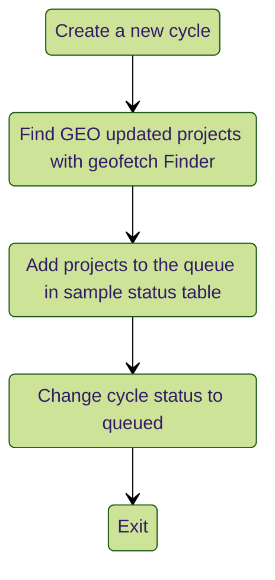
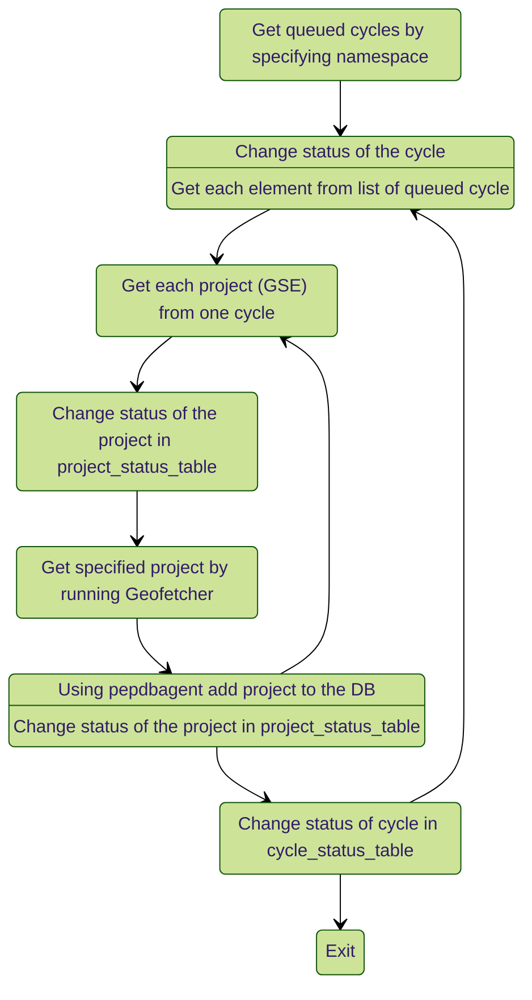
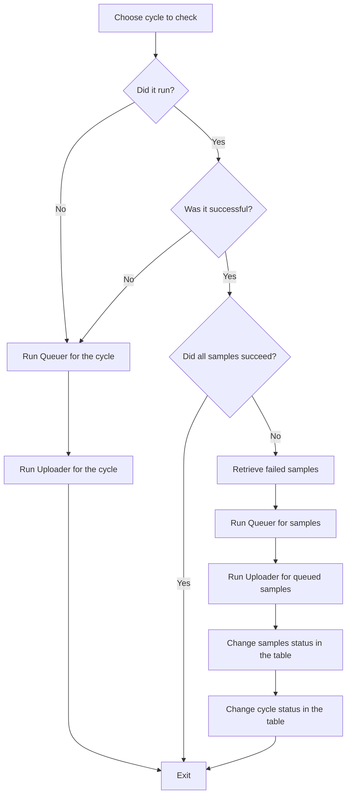

[](https://github.com/pepkit/geopephub)


<h1 align="center">geopephub</h1>

### Automatic uploader of GEO metadata projects to [PEPhub](https://pephub.databio.org/geo).


This repository contains `geopephub` CLI, that enables to automatic upload GEO projects to PEPhub based on date and scheduled automatic uploading using GitHub actions. 
Additionally, the CLI includes a download command, enabling users to retrieve projects from specified namespace directly from the PEPhub database. This feature is particularly helpful for downloading all GEO projects at once.

---

**Documentation**: <a href="https://pep.databio.org/pephub" target="_blank">https://pep.databio.org/pephub</a>

**Source Code**: <a href="https://github.com/pepkit/geopephub" target="_blank">https://github.com/pepkit/geopephub</a>

---


## Installation
To install `geopephub` use this command: 
```
pip install git+https://github.com/pepkit/geopephub.git
```

# Overview:
The `geopephub` consists of 4 main functionalities:

1) Queuer: This module comprises functions that scan for new projects in **GEO**, generate a new cycle for the current run, and log details for each GEO project. It sets the project status to `queued` and adds it to the database.
2) Uploader: Checks if there are any queued cycles in the `cycle_status` table. It retrieves a list of queued projects, executes `GEOfetch` to download them, and uploads the results to PEPhub database using `pepdbagent`. `geopephub` updates the project upload status at each step, allowing for later checks to determine why the upload failed and what occurred.
3) Checker: This component examines previous cycles, verifies their status, and determines if they were executed. If a cycle was not executed or was unsuccessful, it triggers a rerun. In cases where only one project was unsuccessful, it attempts to upload it again. Additionally, if the cycle does not exist, it creates one using the queuer and uploads files using the uploader.
4) Downloader: Retrieves projects from the specified namespace, filters by uploading or updating date, and optionally sorts by name or date. It also allows setting a limit on the number of downloaded projects. Projects can be downloaded locally or to a specified S3 bucket. For more information, use the  `geopephub --help` command


More information about these processes can be found in the flowcharts and overview below.


## Queuer Flowchart:


## Uploader Flowchart:



## Checker Flowchart:

