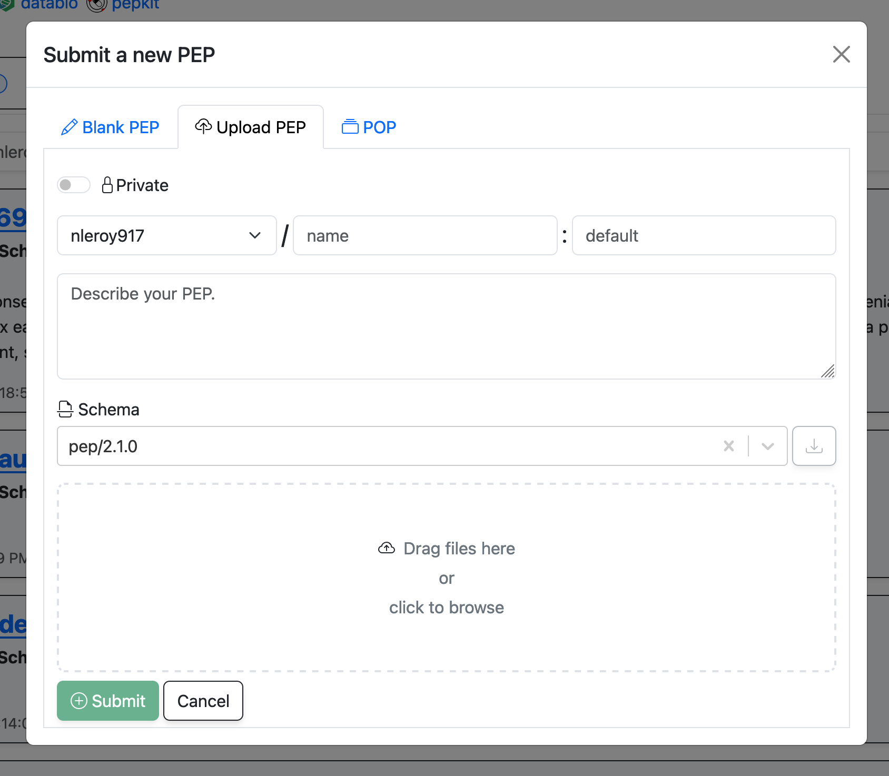

# Getting started with PEPhub

## What is PEPhub?

Just like GitHub allows you to share and edit projects that you are tracking with `git`, PEPhub allows you to share and edit **biological metadata** that is formatted as a **PEP** (a Portable Encapsulated Project). PEPhub allows you to:

- **Upload** your metadata to a central database
- **Edit** your metadata in a web interface
- **Share** your metadata with collaborators
- **Validate** your metadata using a schema
- **Access** and update metadata programmatically through an API, from Python or R.

## What is a PEP?

Portable Encapsulated Projects (PEPs) are standard format for biological sample metadata.  A PEP is simply a **csv** file representing a sample table, plus an *optional* **YAML** file for project-level metadata and sample modifiers.  For more details, read the [PEP specification](http://pep.databio.org/spec/simple-example).

PEPhub gives you a platform to store and collaborate on your PEPs. This makes it easier to work together for large or small teams. Instead of relying on local files that you send back-and-forth, PEPhub provides a centralized interface and API that simplifies sharing and collaboration.

## Your first PEP on PEPhub

### Logging in

You log in to PEPhub using your [GitHub account](https://github.com/signup). Just click the "Log in" button in the top right corner of the [PEPhub home page](https://pephub.databio.org). 

You will be redirected to GitHub to authorize the PEPhub application. You are now logged in and can upload your first PEP! There are two mains ways to add a PEP to your PEPhub namespace: you can either [upload a PEP directly](#uploading-a-pep), or you can [create a new PEP from scratch](#creating-a-new-pep-from-scratch) using the web interface. This guide will walk you through both methods.

### Uploading a PEP

Navigate to your PEPhub namespace (`https://pephub.databio.org/{github username}`) and click the "Add" button in the top right. Click the "Upload PEP" tab. You will be prompted to select a PEP file from your local machine. Fill in the details about your PEP and then either drag files to the drop zone or click the drop zone to select files from your computer. Click "Submit" to add the PEP to your namespace.

### Creating a new PEP from scratch

Navigate to your PEPhub namespace (`https://pephub.databio.org/{github username}`) and click the "Add" button in the top right. Click the "Blank PEP" tab. Again, fill in the details about your PEP and then you can start filling in the sample table. Click "Submit" to add the PEP to your namespace.

## Editing a PEP

Once you have uploaded or created a PEP, you can edit it. Editing a PEP is easy; just make changes in the table and click `Save` when you are finished.

## Sharing your PEP

By default, new PEPs are set to public access. This means anyone who has the link can read your table. You can share it by simply sharing the URL. You can restrict this by marking it as `private` in the Project edit menu.

If you want to give another user *write* access, then you'll need to do a bit more work. Since PEPhub user permissions are inherited directly from GitHub, you'll use GitHub to manage these. You should transfer the PEP into an organization where both users are public members. This will give both users write access to the PEP.

