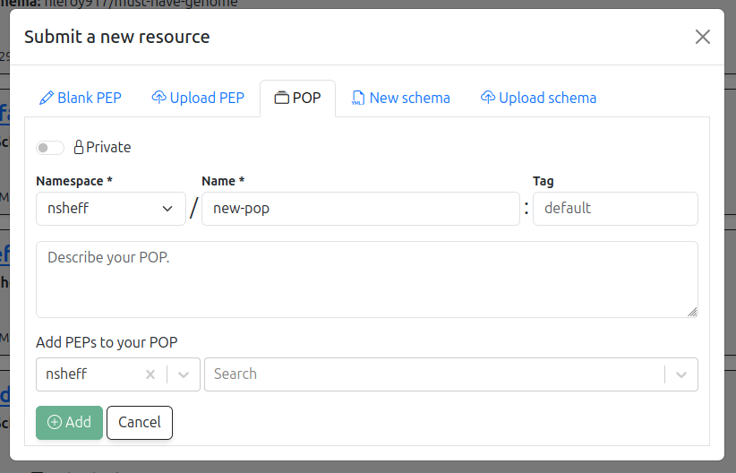
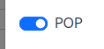
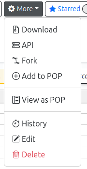

# How to organize groups of PEPs

### How can I organize PEPs into groups?

We call a group of PEPs a POP -- it stands for PEP of PEPs. Since a PEP is fundamentally a table, and we make a table where each row is a link to another table.
So, that's a table of tables -- or a PEP of PEPs, which we call a POP for short.

A POP is simply a group of PEPs represented as a PEP. Users can think of it as a group, collection, or folder of projects. 
It groups PEPs together to represent similar projects, analyses, or related information, making it easier to manage and navigate related proposals.

Each POP can contain other PEPs or POPs (since a POP is a PEP), allowing for a recursive structure. 
This recursive nature enables complex hierarchies and relationships to be efficiently organized within the PEP framework.

### How to use POPs

A POP is actually just a PEP, that has a special flag set. You can create a new POP in the typical *Add PEP* interface; just select the *POP* tab.

If you already have a PEP and you want to designate it as a POP, just make sure it has at least these 3 columns: `namespace`, `name`, and `tag`, which correspond to the registry path for the PEP. You can add whatever other columns you want. Then, just toggle the POP toggle button in the settings interface for the PEP:

### Views

There are two ways to view a POP. First, since a POP *is* a PEP, you can just use the regular table view, the same as you would any PEP. 
Second, you can use a special "POP" view, which just shows you a linked list of the PEPs contained in the pop.
Toggle between the two views using the *More* context menu, which provides a *View as POP* or *View as PEP* options for any PEP that has the POP toggle checked.

