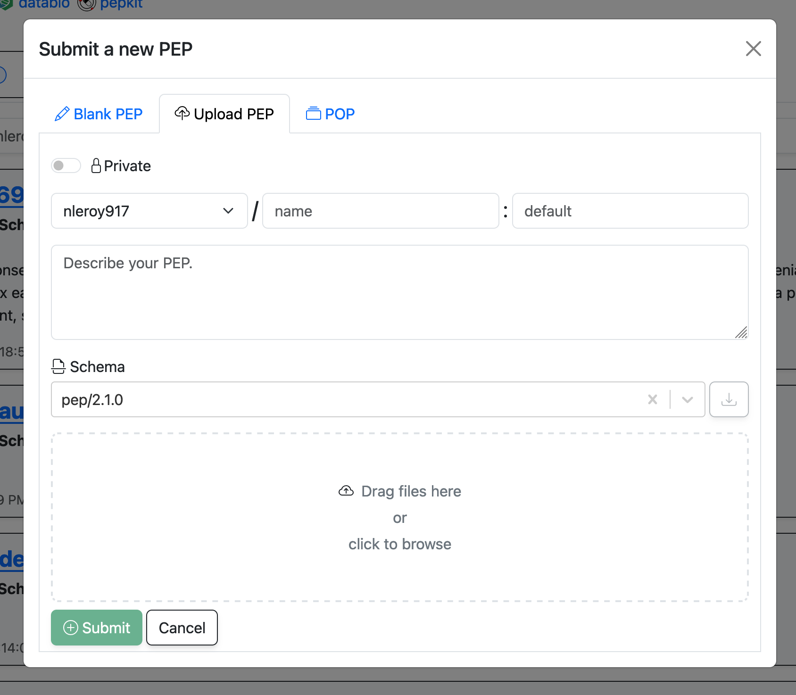

# Uploading PEPs to PEPhub
*Learn about how you can start adding PEPs to your namespace on PEPhub.*

There are two mains ways to add a PEP to your PEPhub namespace: you can either [upload a PEP directly](#uploading-a-pep), or you can [create a new PEP from scratch](#creating-a-new-pep-from-scratch) using the web interface. This guide will walk you through both methods.

## Uploading a PEP
Navigate to your PEPhub namespace (`https://pephub.databio.org/{github username}`) and click the "Add" button in the top right. Click the "Upload PEP" tab. You will be prompted to select a PEP file from your local machine. Fill in the details about your PEP and then either drag files to the drop zone or click the drop zone to select files from your computer. Click "Submit" to add the PEP to your namespace.

## Creating a new PEP from scratch
Navigate to your PEPhub namespace (`https://pephub.databio.org/{github username}`) and click the "Add" button in the top right. Click the "Blank PEP" tab. Again, fill in the details about your PEP and then you can start filling in the sample table. Click "Submit" to add the PEP to your namespace.

## Ready to edit your PEP
Once you have uploaded or created a PEP, you can now start editing it!

[Editing your PEP](/pephub/user/editing){ .md-button .md-button--primary }