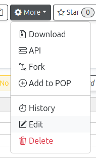
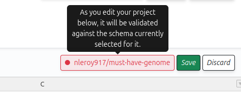

# How to validate sample metadata

PEPhub validates sample metadata with [eido](../eido/README.md). Schemas can be added and edited on PEPhub directly.

Schemas are particularly useful before running pipelines, as validation provides essential information about PEP compatibility with specific pipelines and highlights any errors in the PEP structure.

There are two ways to use the interfaced to validate PEPs: From the main PEP interface, or from the universal validator.

## Validating a PEP from the main PEP interface

If you're editing a PEP, it's convenient to be able to validate it from the same interface. First, assign a schema to the PEP, and then validation will happen automatically, whenever you save the project.

### Assign a schema to a PEP

From the main table view, use the *Edit* menu to access the properties for a PEP:

In this interface, you can select a schema for this PEP.

### Validating

Once a schema is assigned you'll see the validation results:

If you click on this notice, you'll see more detailed information about what in the table is causing the validation to fail. This will allow you to validate metadata in real time, as you work on the table.

## Using the universal validator

Alternatively, for a more flexible approach, you can use the [Universal Validator](https://pephub.databio.org/validate). This provides a 2-step interface where you first provide a PEP, either by selecting one from PEPhub or by uploading it, and then a schema, which can be either selected from PEPhub, uploaded, or pasted.
