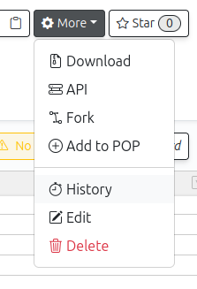
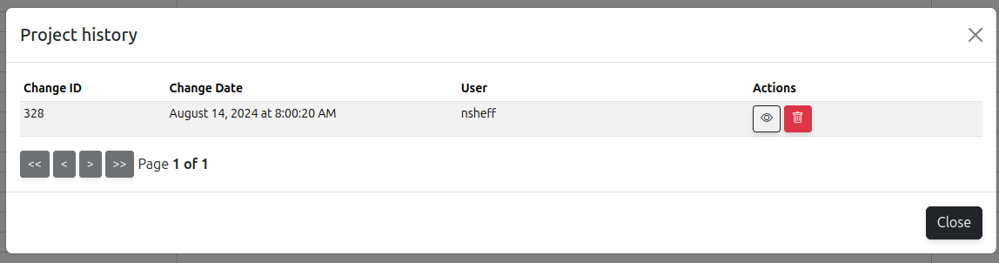

# How to version control metadata with PEPhub

PEPhub table versions happen through two features: 1) history; and 2) tags.

## History

PEPhub automatically records a history of your files whenever changes are made. Any time you click "save", an entry is added to your history. You can view the history of table edits by selecting the `History` option from the `More` menu.



Selecting this option will bring up the *History Interface*, which will provide buttons allowing you to view or delete entries from your history table. If you choose the `View` button for an entry, it will show you the PEP at that point in history. It also opens a new interface that will allow you to click `Restore` to overwright your current PEP with the historical version you are currently viewing, or you can `Download` the table as it was at that point in history.



In PEPhub, old versions are kept automatically, and they are referenced by date. PEPhub does not automatically assign version numbers or other identifiers; the only way to identify the old versions is by timestamp.


### History retention policy

**Old versions of sample tables are kept for 30 days.** Once a history entry is more than 30 days old, it will be automatically purged. If you want to keep an old version for longer, then you will need to manually tag the version, thereby forking it into a new repository.

## Tags

The other versioning feature offered by PEPhub is to use tags. PEPhub tags are unique identifiers of repositories. Every repository has a tag. By default, the tag is simply *default*. The registry path of each PEP takes the form of:

```
{namespace}/{repository}:{tag}
```

For example, `nsheff/my_new_pep:v1` would be the `my_new_pep` repository in my user namespace (`nsheff`), and `v1` is the tag. You can use tags to version your own PEPs. When you're ready to declare a version, just fork the current PEP into a new PEP and name the version tag accordingly.
