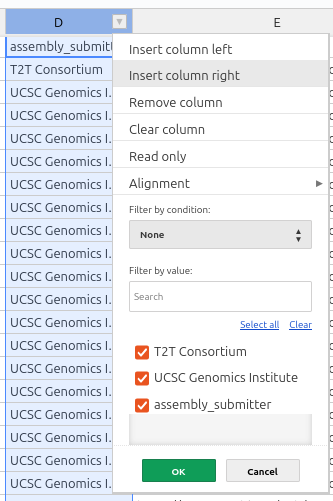
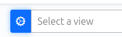

# How to use PEPhub views

## What are views?

Large tables (*e.g.* >5,000 rows) can be unwieldy with PEPhup. It can be hard to find the elements you're looking for. To address this, PEPhub provides the *Views* feature. Views provide a way to look at a subset of a large table (basically, a filtered table).

## How to create a view

To create a new view, click the *Down Arrow* to access the filter menu, and set up a filter. This will change the table to display a subset of the rows.

Then, you can use the View Settings menu (gear icon next to the view selector) to open the Views interface.

This will allow you to save the view. You can then select it any time from the views menu.

## Read-only limitation

Views are currently read-only; you will not be able to make edits to the table while viewing a subset. We hope to remove this restriction in the future.