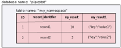

<h1>Pipestat specification</h1>

[TOC]

# Introduction

Pipelines, or workflows, are made from a set of commands that process input data and produce results. These results may take many forms, such as simple statistics, string variables, images, or processed data files. How do pipelines structure the results they produce? There is no standard structure for results, so usually, it's done differently for each pipeline. This restricts the portability of the outputs of pipelines, and makes it difficult to write software that can process results from a variety of different pipelines. As a result, each pipeline author usually writes dedicated report functions for each pipeline.

Pipestat provides a formal specification for how a pipeline should structure its results. Therefore, any pipeline that follows the pipestat specification will record results in the same way. This makes it possible to build generic report software that can work with any pipestat-compatible pipeline, offloading the task of making pretty result reports to generic tools.

This document outlines the specification for pipestat results. If your pipeline stores results like this, then downstream tools that read pipestat results will be able to build nice summaries of your pipeline runs automatically. To write results according to this specification, you can use the reference implementation (the `pipestat` python package), or you can simply write your results to this specification using whatever system you like.

# Terminology

- *result*: An element produced by a pipeline. Results have defined data types, described herein.
- *result identifier*. The name of a result, such as `aligned_read_count` or `duplication_rate`.
- *value*. The actual data for an output result for a given record.
- *namespace*: A way to group results that belong together. In the api, this is referenced via `pipeline_name`. This is typically an identifier for a particular pipeline, like `rnaseq-pipeline`. All results from this pipeline will share this namespace.
- *record identifier*. An identifier for a particular pipeline run, such as a sample name.
- *pipestat specification*: the way to structure a set of results stored from one or more pipeline runs.
- *backend*. The technology underlying the result storage, which can be either a simple file or a database.

# Data types

Each *result* reported by a pipeline must have a specified data type. Pipestat is built on jsonschema types, so the jsonschema documentation outlines the [basic available types](https://cswr.github.io/JsonSchema/spec/basic_types/). These types are:

- string
- number
- integer
- boolean
- null

Importantly, pipestat extends the jsonschema vocabulary by adding two additional types, which are common results of a pipeline: `image` and `file`. These types require reporting objects with the following attributes:

- `file`:
    - `path`: path to the reported file
    - `title`: human readable description of the file
- `image`:
    - `path`: path to the reported image, usually PDF
    - `thumbnail`: path to the reported thumbnail, usually PNG or JPEG
    - `title`: human readable description of the image

# Pipestat output schema

Each pipestat-compatible pipeline must define a *pipestat output schema*. The pipestat schema is where the pipeline author describes the results produced by the pipeline. The pipestat schema specifies:

1. The result identifiers; that is, the immutable names of all the results reported by this pipeline.
2. The data types associated with each result.
3. Human-readable description of what each result represents.

As a pipeline developer, your schema defines and describes all the important results to be recorded from your pipeline.

Pipestat uses the schema as a base for creating a collection of self-contained result-specific [jsonschema schemas](https://json-schema.org/) that are used to **validate** the reported results prior to storing them.

## Pipestat output schema format

The pipestat output schema is a YAML-formatted file. The top level keys are the unique result identifiers. The associated values are jsonschema types. The `type` attribute is required. This is an example of a minimal component, specifying only an identifier, and its type:

```yaml
result_identifier:
  type: <type>
```

Here, `result_identifier` can be whatever name you want to use to identify this result. Here's a simple schema example that showcases most of the supported types:

```yaml
title: Example Pipestat Output Schema
description: A pipeline that uses pipestat to report sample level results.
type: object
properties:
  pipeline_name: "default_pipeline_name"
  samples:
    type: object
    properties: # result identifiers are properties of the samples object
      number_of_things:
        type: integer
        description: "Number of things"
      percentage_of_things:
        type: number
        description: "Percentage of things"
      name_of_something:
        type: string
        description: "Name of something"
      switch_value:
        type: boolean
        description: "Is the switch on or off"
```

Here's a more complex schema example that showcases some of the more advanced jsonschema features:

```yaml
title: An example Pipestat output schema
description: A pipeline that uses pipestat to report sample and project level results.
type: object
properties:
  pipeline_name: "default_pipeline_name"
  samples:
    type: array
    items:
      type: object
      properties:
        number_of_things:
          type: integer
          description: "Number of things"
        percentage_of_things:
          type: number
          description: "Percentage of things"
        name_of_something:
          type: string
          description: "Name of something"
        switch_value:
          type: boolean
          description: "Is the switch on or off"
        md5sum:
          type: string
          description: "MD5SUM of an object"
          highlight: true
        collection_of_images:
          description: "This store collection of values or objects"
          type: array
          items:
            properties:
                prop1:
                  description: "This is an example file"
                  $ref: "#/$defs/file"
        output_file_in_object:
          type: object
          properties:
            prop1:
              description: "This is an example file"
              $ref: "#/$defs/file"
            prop2:
              description: "This is an example image"
              $ref: "#/$defs/image"
          description: "Object output"
        output_file_in_object_nested:
          type: object
          description: First Level
          properties:
            prop1:
              type: object
              description: Second Level
              properties:
                prop2:
                  type: integer
                  description: Third Level
        output_file:
          $ref: "#/$defs/file"
          description: "This a path to the output file"
        output_image:
          $ref: "#/$defs/image"
          description: "This a path to the output image"
$defs:
  image:
    type: object
    object_type: image
    properties:
      path:
        type: string
      thumbnail_path:
        type: string
      title:
        type: string
    required:
      - path
      - thumbnail_path
      - title
  file:
    type: object
    object_type: file
    properties:
      path:
        type: string
      title:
        type: string
    required:
      - path
      - title

```

## Results highlighting

The pipestat specification allows to highlight results by adding `highlight: true` attribute under result identifier in the schema file. In the example below the `log_file` result will be highlighted.

```yaml
number_of_things:
  type: integer
  description: "Number of things"
percentage_of_things:
  type: number
  description: "Percentage of things"
log_file:
  type: file
  description: "Path to the log file"
  highlight: true
```

The highlighted results can be later retrieved by pipestat clients via `PipestatManager.highlighted_results` property, which simply returns a list of result identifiers.

# Status schema

Apart from results reporting pipestat provides a robust pipeline status management system, which can be used to report pipeline status from within the pipeline and monitor pipeline's status in other software. Status schema file defines the possible pipeline status identifiers and provides other metadata, like `description` or `color` for display purposes.

Here's an example of the pipestat status schema, which at the same time is the default status schema shipped with the pipestat Python package:

```yaml
running:
  description: "the pipeline is running"
  color: [30, 144, 255] # dodgerblue
completed:
  description: "the pipeline has completed"
  color: [50, 205, 50] # limegreen
failed:
  description: "the pipeline has failed"
  color: [220, 20, 60] # crimson
waiting:
  description: "the pipeline is waiting"
  color: [240, 230, 140] # khaki
partial:
  description: "the pipeline stopped before completion point"
  color: [169, 169, 169] # darkgray
```

As depicted above the top-level attributes are the status identifiers. Within each section two attributes are required:

- `description` (`str`) a freeform text exhaustively describing the status code.
- `color` (`list[int]`) an array of integers of length 3 which specifies the desired color associated with the status in RGB color model.

# Backends

The pipestat specification describes two backend types for storing results: a [YAML-formatted file](https://yaml.org/spec/1.2/spec.html) or a [PostgreSQL database](https://www.postgresql.org/). This flexibility makes pipestat useful for a wide variety of use cases. Some users just need a simple text file for smaller-scale needs, which is convenient and universal, requiring no database infrastructure. For larger-scale systems, a database back-end is necessary. The pipestat specification provides a layer that spans the two possibilities, so that reports can be made in the same way, regardless of which back-end is used in a particular use case.

By using the `pipestat` package to write results, the pipeline author need not be concerned with database connections or dealing with racefree file writing, as these tasks are already implemented. The user who runs the pipeline will simply configure the pipestat backend as required.

Both backends organize the results in a hierarchy which is *always* structured this way:


## YAML file

For the YAML file backend, each file represents a namespace. The file always begins with a single top-level key which indicates the namespace. Second-level keys correspond to the record identifiers; third-level keys correspond to result identifiers, which point to the reported values. The values can then be any of the allowed pipestat data types, which include both basic and advanced data types.

```yaml
my_namespace:
    record1:
        my_result: 10
        my_result1:
            key: "value1"
    record2:
        my_result: 3
        my_result1:
            key: "value2"
```

A more concrete example would be:

```yaml
rnaseq-pipe:
    patient1:
        duplicate_rate: 10
        genomic_distribution:
            promoter: 15
            enhancer: 85
    patient2:
        duplicate_rate: 3
        genomic_distribution:
            promoter: 30
            enhancer: 70
```

## PostgreSQL database

For the PostgreSQL backend, the name of the database is configurable and defined in the [config file](config.md) in `database.name`. The database is structured like this:

- The namespace corresponds to the name of the table.
- The record identifier is indicated in the *unique* `record_identifier` column in that table.
- Each result is specified as a column in the table, with the column name corresponding to the result identifier
- The values in the cells for a record and result identifier correspond to the actual data values reported for the given result.


