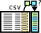
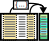

<!-- Table of contents: 
* The generated Toc will be an unordered list
{:toc} -->

<h1>PEP specification version 2.0.0</h1>

Table of contents:

[TOC]

## Introduction

Organizing and annotating sample data is an important task in data-intensive bioinformatics, but each dataset is typically annotated in a unique way. Furthermore, data processing tools typically expect a unique format for sample annotation. There is no standard way to represent metadata that spans projects and tools. This restricts the portability and reusability of annotated datasets and software that processes them.

*Portable Encapsulated Projects* (*PEP* for short) seeks to make datasets and related software more portable and reusable. PEP does this by providing *metadata standarization*, *metadata validation*, and *portability modifiers*.

## How PEP improves sample annotation portability

PEP provides 3 features to improve portability: 

1. **A standardized metadata structure**. The PEP specification is a standardized way to represent sample annotation information. This allows tools and pipelines to read data from different sources more easily.
2. **A validation framework**. The PEP specification provides a way to construct formal validation schemas. This allows us to validate that a project or sample complies with a requirements for an arbitrary tool. PEP uses an [extended JSON-schema system](howto_schema.md) with added features specific to the sample annotation use case.
3. **Project and sample modifiers**. The PEP specification provides a powerful framework to *programatically modify* sample- and project-level metadata. This makes it easy to systematize metadata so that one input source can be easily used with multiple tools.

## Definitions of terms and components of a PEP

A PEP can be made from any collection of metadata represented in tabular form. Typically, a PEP represents a data-intensive bioinformatics project with many samples, like individuals or cell lines. The key terms are:

- **Project**: a collection of metadata that annotates a set of samples.
- **Sample**: loosely defined; a unit that can be collected into a project, usually with one or more data files.
- **PEP specification**: the way to organize project and sample *meta*data in files using a `yaml` + `csv` format.
- **PEP**: a project that follows the PEP specification.

<figure>

<figcaption>A PEP consists of 3 components</figcaption>
</figure>


The PEP specification divides metadata into components: sample metadata, which can vary by sample, and project metadata, which applies to all samples. These components are stored in separate files. A complete PEP consists of up to 3 files:

- **Project config file** - REQUIRED. a `yaml` file containing project-level metadata
- **Sample table** - RECOMMENDED. a `csv` file of sample metadata, with 1 row per sample
- **Subsample table** - OPTIONAL. A `csv` file of sample  with multiple rows for each sample, used to specify sample attributes with multiple values (*e.g.* used to point to inputs in sequencing experiments when split across multiple files).


This document describes each of these 3 files in detail.

<!-- ## Goals and benefits of using a PEP

The PEP specification has 2 primary goals:

1. To make sample-heavy sample annotations more reusable. By making it easy to decouple analysis-specific or environment-specific information from the sample metadata, it becomes eas

2. To make software that analyzes multi-sample datasets more reusable. applying tools to external data. 

3. To provide a way to formalize required metadata and validate it. The PEP specification provides a generic schema and an easy to way to extend it so that tool developers can formally describe what sample and project metadata their tool requires. Users can then use validation to identify which software is compatible with their data. -->

## Validating a PEP

The formal PEP spec is described as a schema at [schema.databio.org/pep/2.0.0.yaml](https://schema.databio.org/pep/2.0.0.yaml). You can validate a PEP against a PEP schema using the [eido Python package](http://eido.databio.org) like this:

```
eido validate path/to/your/PEP_config.yaml -s https://schema.databio.org/pep/2.0.0.yaml
```

PEP schemas use an extended [JSON-schema](https://json-schema.org/) vocabulary. The generic schema may be easily extended into a more specific schema that adds new requirements or optional attributes, requires input files, and so forth. You can find more detail about how to extend and use these schemas in the [How-to guide for PEP validation](howto_schema.md).

## Project config file specification

The project config file is the source of project-level information. It is the only required file and must be in `yaml` format. The config file includes five recognized project attributes, most being optional:

- `pep_format_version` - REQUIRED
- `sample_table`- RECOMMENDED
- `subsample_table`- OPTIONAL
- `sample_modifiers` - OPTIONAL
- `project_modifiers` - OPTIONAL

These attributes may appear in any order.

Example

```
pep_version: 2.0.0
sample_table: "path/to/sample_table.csv"
subsample_table: "path/to/subsample_table.csv"
sample_modifiers:
  append:
    attribute1: value
    attr2: val2	
  duplicate:
    oldattr: newattr
  imply:
    - if:
        genome: ["hg18", "hg19", "hg38"]
      then:
        organism: "human"
  derive:
    attributes: [read1, read2, other_attr]
    sources:
      key1: "path/to/derived/value/{sample.attribute}/{project.attribute}"
      key2: "path/to/derived/value/{sample.attribute}/{project.attribute}"
project_modifiers:
  amend:
    variant1:
      sample_table: "path/to/alternative_table.csv"
  import:
    - external_pep.yaml
    - http://url.com/pep.yaml
```

### Project attribute: `pep_version`

The only required project attribute, which documents the version of the PEP specification this PEP complies with. For PEP version 2.0.0, this must be the string `"2.0.0"`.

### Project attribute: `sample_table`

The `sample_table` is a path (string) to the sample csv file. It can be absolute or relative; relative paths are assumed relative to the location of the `project_config.yaml` file. The target file is expected to comply with the PEP specification for the sample table, described later.

### Project attribute: `subsample_table`

The `subsample_table` is a path (string) to the subsample csv file. Like with the sample_table attribute, relative paths are assumed relative to the location of the `project_config.yaml` file. The target file is expected to comply with the PEP specification for the subsample table.

### Project attribute: `sample_modifiers`

<figure>

<figcaption>Sample modifiers are project settings that modify samples.</figcaption>
</figure>


The sample modifiers allows you to modify sample attributes from within the project configuration file. You can use this to add new attributes to samples in a variety of ways, including attributes whose value varies depending on values of existing attributes, or whose values are composed of existing attribute values. This is a key feature of PEP that allows you to make the sample tables more portable. There are 4 subsections corresponding to 4 types of sample modifier: `append`, `duplicate`, `imply`, and `derive`; and the samples will be modified in that order. Within each modifier, samples will be modified in the order in which the commands are listed.

#### *sample_modifiers.append*

<figure>

<figcaption><i>Append</i> adds a constant attribute to all samples.</figcaption>
</figure>


The `append` modifier adds additional sample attributes with a *constant value across all samples*. 

Example:

```yaml
sample_modifiers:
  append:
    read_type: SINGLE
```

This example adds a `read_type` attribute to each sample, with the value `SINGLE` for all samples. This modifier is useful on its own to add constant attributes, and can also be  combined with `derive` and/or `imply`.


#### *sample_modifiers.duplicate*

<figure>

<figcaption><i>Duplicate</i> copies an attribute to a new name.</figcaption>
</figure>
The `duplicate` modifier copies an existing sample attribute to a new attribute with a different name. This can be useful if you need to tweak a PEP to work under a different tool that specifies a different schema for the same data.

Example:

```yaml
sample_modifiers:
  duplicate:
    old_attribute_name: new_attribute_name
```

This example would copy the value of `old_attribute_name` to a new attribute called `new_attribute_name`.


#### *sample_modifiers.imply*

<figure>

<figcaption><i>Imply</i> depends on other attribute values.</figcaption>
</figure>

The `imply` modifier adds sample attributes with values that depends on the *value* of an existing attribute. Under the `imply` keyword is a list of items. Each item has an `if` section and a `then` section. The `if` section defines one or more attributes, each with one or more possible values. If *all* attributes listed have *any* of the values in the list for that attribute, then the sample passes the conditional and the implied attributes will be added. One or more attributes to imply are listed under the `then` section as `key: value` pairs.

Example:

```yaml
sample_modifiers:
  imply:
    - if:
        organism: "human"
      then:
        genome: "hg38"
        macs_genome_size: "hs"
```

This example will take any sample with `organism` attribute set to the string "human" and add attributes of `genome` (with value "hg38") and `macs_genome_size` (with value "hs"). This example shows only 1 implication, but you can include as many as you like.

Implied attributes can be useful for pipeline arguments. For instance, it may that one sample attribute implies several more. Rather than encoding these each as separate columns in the annotation sheet for a particular pipeline, you may simply indicate in the `project_config.yaml` that samples of a certain type should automatically inherit additional attributes. For more details, see [how to remove project-level attributes from a sample table](howto_genome_id.md).

#### *sample_modifiers.derive*

<figure>

<figcaption><i>Derive</i> builds new attributes from existing values.</figcaption>
</figure>

The `derive` sample modifier converts existing sample attribute values into new values derived from other existing sample attribute values. It contains two sections; in `attributes` is a list of existing attributes that should be derived; in `sources` is a mapping of key-value pairs that defines the templates used to derive the new attribute values.

Example:

```yaml
sample_modifiers:
  derive:
    attributes: [read1, read2, data_1]
    sources:
      key1: "/path/to/{sample_name}_{sample_type}.bam"
      key2: "/from/collaborator/weirdNamingScheme_{ext_id}.fastq"
      key3: "${HOME}/{test_id}.fastq"
```

In this example, the samples should already have attributes named `read1`, `read2`, and `data_1`, which are flagged as attributes to derive. These attribute values should originally be set to one of the keys in the `sources` section: `key1`, `key2`, or `key3`. The `derive` modifier will replace any samples set as `key1` with the specified string (`"/path/to/{sample_name}_{sample_type}.bam"`), but with variables like `{sample_name}` populated with the values of other sample attributes. The variables in the file paths are formatted as `{variable}`, and are populated by sample attributes (columns in the sample annotation sheet). For example, your files may be stored in `/path/to/{sample_name}.fastq`, where `{sample_name}` will be populated individually for each sample in your PEP. You can also use shell environment variables (like ``${HOME}``) or wildcards (like `*`).

Using `derive` is a powerful and flexible way to point to data files on disk. This enables you to point to more than one input file for each sample. For more details and a complete example, see [how to eliminate paths from the sample table](howto_eliminate_paths.md).

### Project attribute: `project_modifiers`

The project modifiers allows you to modify *project-level* attributes from within the project configuration file. There are 2 subsections corresponding to 2 types of project modifier: `import` and `amend`. Imports run first, followed by amendments.

#### *project_modifiers.import*

<figure>

<figcaption><i>Imports</i> include external PEP config files.</figcaption>
</figure>

The `import` project modifier allows the config file to import other external PEP config files. The values in the imported files will be overridden by the corresponding entries in the current config file. Imports are recursive, so an imported file that imports another file is allowed; the imports are resolved in cascading order with the most distant imports happening first, so the closest configuration options override the more distant ones.

Example:

```yaml
project_modifiers:
  import:
    - path/to/parent_project_config.yaml
```

Imports can be used to record and manage complex analysis relationships among analysis components. In a sense, imports are the opposite of amendments, because they allow combining multiple PEP files into one. When used in combination with amendments, they make it possible to orchestrate very powerful analysis. For more information, see [How to integrate imports and amendments](howto_integrate.md).

#### *project_modifiers.amend*

<figure>

<figcaption><i>Amendments</i> specify project variations within one file.</figcaption>
</figure>

The `amend` project modifier specifies multiple variations of a project within one file. When a PEP is parsed, you may select one or more included amendments, which will amend the values in the processed PEP. Unlike all other sample or project modifiers, amendments are optional and must be activated individually when the PEP is loaded.

For example:


```yaml
sample_table: annotation.csv
project_modifiers:
  amend:
    my_project2:
      sample_table: annotation2.csv
    my_project3:
      sample_table: annotation3.csv
...
```

If you load this configuration file, by default it sets `sample_table` to `annotation.csv`. If you don't activate any amendments, they are ignored. But if you choose, you may activate one of the two amendments, which are called `my_project2` and `my_project3`. If you activate `my_project2`, by passing `amendments=my_project2` when parsing the PEP, the resulting object will use the `annotation2.csv` sample_table instead of the default `annotation.csv`. All other project settings will be the same as if no amendment was activated because there are no other values specified in the `my_project2` amendment.

Amendments are useful to define multiple similar projects within a single project config file. Under the amendments key, you specify names of amendments, and then underneath these you specify any project config variables that you want to override for that particular amendment. It is also possible to activate more than one amendment in priority order, which allows you to combine different project features on-the-fly. For more details, see [how to mix and match amendments](howto_mixmatch.md).

## Sample table specification

The `sample_table` is a `.csv` file containing information about all samples (or pieces of data) in a project. **One row corresponds to one sample**. A sample table may contain any number of columns with any column names. Each column corresponds to an attribute of a sample. For this reason, we sometimes use the word `column` and `attribute` interchangeably. 

The only requirement for the column names is that the table **MUST** include a column named `sample_name`, which should specify a **unique** string identifying each sample. This should be a string without whitespace (space, tabs, etc...). Any additional columns become attributes of your sample and will be part of the project's metadata for the samples. 

**Example:**
```
"sample_name","protocol","organism","flowcell","lane", "data_source"
"albt_0h","RRBS","albatross","BSFX0190","1","bsf_sample"
"albt_1h","RRBS","albatross","BSFX0190","1","bsf_sample"
"albt_2h","RRBS","albatross","BSFX0190","1","bsf_sample"
"albt_3h","RRBS","albatross","BSFX0190","1","bsf_sample"
"frog_0h","RRBS","frog","","","frog_data"
"frog_1h","RRBS","frog","","","frog_data"
"frog_2h","RRBS","frog","","","frog_data"
"frog_3h","RRBS","frog","","","frog_data"
```

A sample table with no attributes satisfies the generic PEP requriement, but it isn't really useful for an actual analysis. Therefore, tools that use PEPs should make use of the PEP validation framework to specify further requirements. For more details, see the [How-to guide for PEP validation](howto_schema.md).

## Subsample table specification

Samples that have more than one value for a particular attribute cannot be accommodated easily in tabular form. For this, PEP provides the `subsample_table`, which is a `.csv` file that annotates multi-value sample attributes. Multiple values for an attribute are specified as multiple rows with the same sample name. The subsample table contains a column named `sample_name` that **must** map to the column of the same name in the sample table. One common use case for subsample tables is for when samples have multiple input files of the same type. For example, in a sequence experiment, it's common to split samples across multiple sequencing *lanes*, which each yield a separate file. Subsample tables are one way to associate many files to a single sample attribute.

Here's a simple example. If you define the `sample_table` like this:

```{csv}
sample_name,library
frog_1,anySampleType
frog_2,anySampleType
```

Then point `subsample_table` to the following, which maps `sample_name` to a new column called `file`

```{csv}
sample_name,file
frog_1,data/frog1a_data.txt
frog_1,data/frog1b_data.txt
frog_1,data/frog1c_data.txt
frog_2,data/frog2a_data.txt
frog_2,data/frog2b_data.txt
```

This sets up a simple relational database that maps multiple files to each sample. You can also combine a subsample table with derived attributes; attributes will first be derived and then merged, leading to a very flexible way to point to many files of a given type for single sample.
